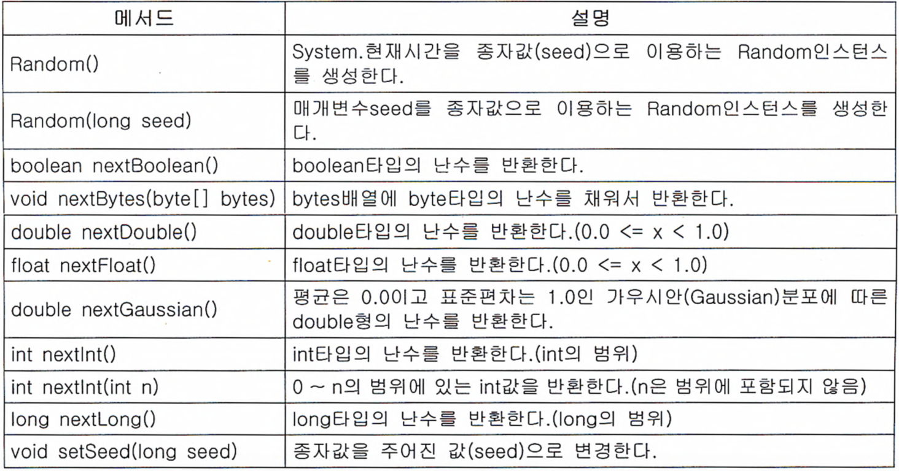
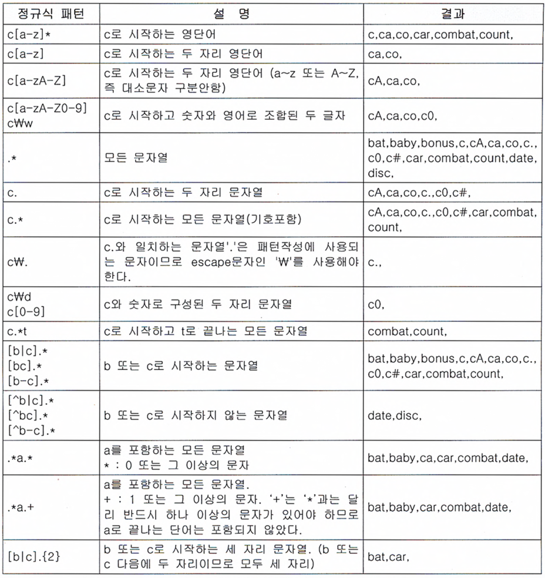

# 유용한 클래스들

> ## Index
> #### 1. Java.lang 패키지
> #### 2. 유용한 클래스들


<br />
<br />

## 1. Java.lang 패키지 (작업중)

<br />
<br />

## 2. 유용한 클래스들
### 2-1. java.util.Objects 클래스
* Objects클래스는 Object의 보조 클래스로 모든 메서드가 static으로 구성되어있다.
* 메서드로는 equals, deepEquals, hashCode, hash, toString, compare, requireNonNull, isNull, nonNull, requireNonNull으로 구성되어있고 주로 널값체크 혹은 값을 비교할 때 사용한다.
    - requireNonNull의 경우 해당 객체가 널이 아니어야 할 경우에 사용하며, 만일 객첵가 널일경우 NullPointerException을 발생시키고 두번째 매개변수에 들어가는 값은 예외일경우 발생하는 메세지가 된다.
``` java
public class Test {

    public void main(String[] args) {

        String str = null;
        Objects.requireNonNull(str, "에러가 발생했습니다.");
    }
}

/*  실행시 콘솔화면
Exception in thread "main" java.lang.NullPointerException: 에러가발생했습니다.
	at java.util.Objects.requireNonNull(Objects.java:228)
	at merong.NewJava.main(NewJava.java:11)
*/
```
* Objects클래스를 이용한 값 비교
``` java
public class Test {

    public void main(String[] args) {

        String str = null;
        System.out.println(Objects.isNull(str));   // 결과값 : true
        System.out.println(Objects.nonNull(str));  // 결과값 : false
    }
}
```
* Object클래스도 equals메서드를 가지고 있는데, Objects클래스가 가진 equals와 다른점은 별도로 Null값 체크를 하지 않아도 된다는점이다.<br />
    (equals메서드만 언급했지만 나머지의 모든 메서드들이 동일하다고 보면 된다.)
``` java
public class Test {

    public void main(String[] args) {

        String name = null;
        String newName = "sunny";

        /*
            Object클래스의 equals를 사용하여 값을 비교
            만약 Null체크를 하지 않고 비교 대상(여기서는 name)에 null이 들어갈경우 NullPointerException이 발생한다.
        */
        if(name != null && name.equals(newName)) {
            System.out.println("equals");
        }

        /* 
            Objects클래스의 equals를 사용하여 값을 비교
            Null 체크를 호하지 않아도 되기때문에 아래와 같이 작성해도 Exception이 발생하지 않는다.
        */
        if(Objects.equals(name, newName)) {
            System.out.println("equals");
        }
    }
}
```


<br />

## 2-2. java.util.Random 클래스
* random클래스는 주로 난수를 얻어야 할 때 사용한다.
* 난수를 얻는 방법은 random클래스와 Math.random()이 있는데, Math.random()의 경우 내부적으로 Random의 인스턴스를 생성하여 사용하는 것이기 때문에 둘중 편한것을 사용하면 된다.
``` java
public class Test {

    public void main(String[] args) {

        double randNum1 = Math.random();    // Math를 이용한 난수생성
        double randNum2 = new Random().nextDouble();    // Random을 이용한 난수생성
    }
}
```
* 난수의 생성범위를 지정해야 할 경우
    - 만일 범위내의 난수생성이 필요할 경우 아래와 같이 범위를 지정해주면 된다.
``` java
public class Test {

    public void main(String[] args) {

        // 1에서 10까지의 정수를 난수로 가져온다. 해당 범위를 지정 해 줄경우 0부터의 n개의 값을 가져오기때문에 1부터 가져오기 위하여 +1을 했다.
        int randNum1 = (int)Math.random() * 10 + 1;
        int randNum2 = new Random().nextInt(10) + 1;
    }
}
```
* Math의 random과 Random의 차이는 종자값 설정에 있는데, 종자값이 같은 random 인스턴스는 항상 같은 난수를 순서대로 반환하기 때문에 같은 종자값을 넣을경우 같은 난수를 얻게 된다고 한다.
    - 만일 따로 종자값을 설정하지 않을경우 System.currentTimeMilis()로 되어 실행할 때 마다 다른값의 난수를 얻게된다.
``` java
public class Test {

    public void main(String[] args) {

        // Rnadom클래스의 종자값을 설정할 경우 같은 값의 난수를 얻게된다.
        int randNum1 = new Random(1).nextInt(); // 결과값 : -1155869325
        int randNum2 = new Random(1).nextInt(); // 결과값 : -1155869325
    }
}
```
* Random클래스의 메서드 목록
</img>


<br />

## 2-3. 정규식 java.util.regex
* 정규식이란 텍스트 데이터를 특정한 패턴조건에 부합하거나 특정 문자열의 추출, 치환하는 과정을 간편하게 처리 할 수 있도록 하는 수단이다.
    - 예) 전화번호의 형식을 0102223333에서 010-222-3333으로 바꾼다거나 입력한 비밀번호가 조건에 부합하는지의 여부확인.

* 정규식의 일부를 괄호()로 그루핑하여 사용 할 수 있다.
* 정규식을 비교하는 과정
    - 적용할 정규식 패턴을 Pattern클래스의 인스턴스로 생성한다.(Pattern의 compile 매서드 이용)
    - Matcher클래스를 이용하여 비교할 값을 가진 인스턴스를 생성한다.(matcher 메서드를 이용)
    - matches 메서드를 이용하여 조건에 부합하는지의 여부를 확인한다.(boolean값을 return한다.)
``` java
public class Test {

    public void main(String[] args) {
        
        //정규식을 이용한 간단한 값 비교
        String str = "Sunny";
        String ptrn = "[a-z]";

        Pattern getPattern = Pattern.compile(ptrn);
        Matcher match = getPattern.matcher(str);

        System.out.println(match.matches());  // 결과값 : false


        //정규식을 이용한 전화번호 형식 비교
        String phonNum = "010-0123-4567";
        String phonPtrn = "(0[0-9]{2})-?([0-9]{3,4})-?([0-9]{4})";

        Pattern newPattern = Pattern.conpile(phonPtrn);
        Matcher matchPhon = newPattern.Matcher(phonNum);

        System.out.println(matchPhon.matches());    // 결과값 : true
    }
}
```
* 