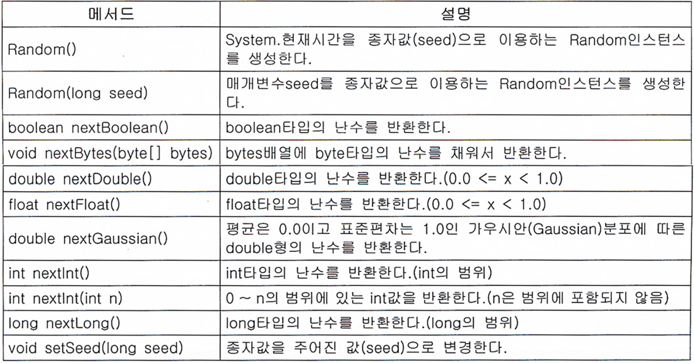

# 유용한 클래스들

> ## Index
> #### 1. Java.lang 패키지
> #### 2. 유용한 클래스들


<br />
<br />

## 1. Java.lang 패키지 (작업중)

<br />
<br />

## 2. 유용한 클래스들
### 2-1. java.util.Objects 클래스
* Objects클래스는 Object의 보조 클래스로 모든 메서드가 static으로 구성되어있다.
* 메서드로는 equals, deepEquals, hashCode, hash, toString, compare, requireNonNull, isNull, nonNull, requireNonNull으로 구성되어있고 주로 널값체크 혹은 값을 비교할 때 사용한다.
    - requireNonNull의 경우 해당 객체가 널이 아니어야 할 경우에 사용하며, 만일 객첵가 널일경우 NullPointerException을 발생시키고 두번째 매개변수에 들어가는 값은 예외일경우 발생하는 메세지가 된다.
``` java
public class Test {

    public void main(String[] args) {

        String str = null;
        Objects.requireNonNull(str, "에러가 발생했습니다.");
    }
}

/*  실행시 콘솔화면
Exception in thread "main" java.lang.NullPointerException: 에러가발생했습니다.
	at java.util.Objects.requireNonNull(Objects.java:228)
	at merong.NewJava.main(NewJava.java:11)
*/
```
* Objects클래스를 이용한 값 비교
``` java
public class Test {

    public void main(String[] args) {

        String str = null;
        System.out.println(Objects.isNull(str));   // 결과값 : true
        System.out.println(Objects.nonNull(str));  // 결과값 : false
    }
}
```
* Object클래스도 equals메서드를 가지고 있는데, Objects클래스가 가진 equals와 다른점은 별도로 Null값 체크를 하지 않아도 된다는점이다.<br />
    (equals메서드만 언급했지만 나머지의 모든 메서드들이 동일하다고 보면 된다.)
``` java
public class Test {

    public void main(String[] args) {

        String name = null;
        String newName = "sunny";

        /*
            Object클래스의 equals를 사용하여 값을 비교
            만약 Null체크를 하지 않고 비교 대상(여기서는 name)에 null이 들어갈경우 NullPointerException이 발생한다.
        */
        if(name != null && name.equals(newName)) {
            System.out.println("equals");
        }

        /* 
            Objects클래스의 equals를 사용하여 값을 비교
            Null 체크를 호하지 않아도 되기때문에 아래와 같이 작성해도 Exception이 발생하지 않는다.
        */
        if(Objects.equals(name, newName)) {
            System.out.println("equals");
        }
    }
}
```


<br />

## 2-2. java.util.Random 클래스
* random클래스는 주로 난수를 얻어야 할 때 사용한다.
* 난수를 얻는 방법은 random클래스와 Math.random()이 있는데, Math.random()의 경우 내부적으로 Random의 인스턴스를 생성하여 사용하는 것이기 때문에 둘중 편한것을 사용하면 된다.
``` java
public class Test {

    public void main(String[] args) {

        double randNum1 = Math.random();    // Math를 이용한 난수생성
        double randNum2 = new Random().nextDouble();    // Random을 이용한 난수생성
    }
}
```
* 난수의 생성범위를 지정해야 할 경우
    - 만일 범위내의 난수생성이 필요할 경우 아래와 같이 범위를 지정해주면 된다.
``` java
public class Test {

    public void main(String[] args) {

        // 1에서 10까지의 정수를 난수로 가져온다. 해당 범위를 지정 해 줄경우 0부터의 n개의 값을 가져오기때문에 1부터 가져오기 위하여 +1을 했다.
        int randNum1 = (int)Math.random() * 10 + 1;
        int randNum2 = new Random().nextInt(10) + 1;
    }
}
```
* Math의 random과 Random의 차이는 종자값 설정에 있는데, 종자값이 같은 random 인스턴스는 항상 같은 난수를 순서대로 반환하기 때문에 같은 종자값을 넣을경우 같은 난수를 얻게 된다고 한다.
    - 만일 따로 종자값을 설정하지 않을경우 System.currentTimeMilis()로 되어 실행할 때 마다 다른값의 난수를 얻게된다.
``` java
public class Test {

    public void main(String[] args) {

        // Rnadom클래스의 종자값을 설정할 경우 같은 값의 난수를 얻게된다.
        int randNum1 = new Random(1).nextInt(); // 결과값 : -1155869325
        int randNum2 = new Random(1).nextInt(); // 결과값 : -1155869325
    }
}
```
* Random클래스의 메서드 목록
</img>


<br />

## 2-3. 정규식 java.util.regex
* 정규식이란 텍스트 데이터를 특정한 패턴조건에 부합하거나 특정 문자열의 추출, 치환하는 과정을 간편하게 처리 할 수 있도록 하는 수단이다.
    - 예) 전화번호의 형식을 0102223333에서 010-222-3333으로 바꾼다거나 입력한 비밀번호가 조건에 부합하는지의 여부확인.

* 정규식의 일부를 괄호()로 그루핑하여 사용 할 수 있다.
* 정규식을 비교하는 과정
    - 적용할 정규식 패턴을 Pattern클래스의 인스턴스로 생성한다.(Pattern의 compile 매서드 이용)
    - Matcher클래스를 이용하여 비교할 값을 가진 인스턴스를 생성한다.(matcher 메서드를 이용)
    - matches 메서드를 이용하여 조건에 부합하는지의 여부를 확인한다.(boolean값을 return한다.)
``` java
public class Test {

    public void main(String[] args) {
        
        //정규식을 이용한 간단한 값 비교
        String str = "Sunny";
        String ptrn = "[a-z]";

        Pattern getPattern = Pattern.compile(ptrn);
        Matcher match = getPattern.matcher(str);

        System.out.println(match.matches());  // 결과값 : false

        //정규식을 이용한 전화번호 형식 비교
        String phonNum = "010-0123-4567";
        String phonPtrn = "(0[0-9]{2})-?([0-9]{3,4})-?([0-9]{4})";

        Pattern newPattern = Pattern.compile(phonPtrn);
        Matcher matchPhon = newPattern.Matcher(phonNum);

        System.out.println(matchPhon.matches());    // 결과값 : true
    }
}
```
* Matcher를 이용한 글씨의 위치 찾기 및 해당 글씨 치환예제
``` java
public class Test {

    public void main(Sting[] args) {

        String fullWord = "랄랄라 랄랄라 랄라랄랄라 히히";
        String find = "라";

        Pattern pattern = Pattern.compile(find);
        Matcher metch = pattern.matcher(fullWord);

        StringBuffer newWord = new StringBuffer();  // 치환될 문자열이 담길 객체

        while(metch.find()) {
            // fullWord에서 find가 위치환 index 위치를 찾는다. 
            System.out.println(metch.start() + "번째 글씨부터 " + metch.end() + "글씨까지 해당됩니다.");
            metch.appendReplacement(newWord, "메롱"); // find된 문자열을 새로운 문자로 치환
        }
        metch.appendTail(newWord); // 치환되지 않은 나머지 뒤의 문자열를 추가한다.
        System.out.println(newWord); // 결과값 : 랄랄메롱랄랄메롱 랄메롱랄랄메롱 히히
    }
}
```


<br />

## 2-4. java.util.Scanner 클래스
* Scanner클래스는 파일과 같은 입력소스에서 문자열을 읽어오기 위해 생성되었다.
* 라인단위의 검색을 지원하고 정규식표현을 사용할 수 있기 때문에 복잡한 형태의 구분자도 처리할 수 있다.
* 주의점
    - 데이터 형식에 따라 사용할 수 있는 메서드가 나뉘어있기 때문에 실제 입력된 데이터의 형태에 맞는 메서드를 사용해야 한다.
    - 만약 데이터 형식에 맞지 않는 메서드를 사용할 경우 InputMismatchException이 발생한다.
``` java
public class Test {

    public void main(String[] args) throws FileNotFoundException {

        // Scanner를 이용한 화면 입력값을 String 객체로 변경하기
        Scanner getName = new Scanner(System.in);
        
        System.out.prntln("이름을 입력해주세요 : ");
        String name = getName.nextLine();
        System.out.println("안녕하세요, " + name + "님");

        // Scanner를 이용한 파일 내의 데이터를 String 객체로 변경하기
        Scanner getFile = new Scanner(new File("newfile.txt"));
        String getText = "";

        while(getFile.hasNextLine()) {
            getText += getFile.nextLine();
        }
        System.out.println(getText);
    }
}
```


<br />

## 2-5. java.util.StringTokenizer 클래스
* 문자열을 지정한 구분자를 기준으로 토큰(token)이라는 여러개의 문자열로 잘라내기 위해 사용한다.
* tokenizer외에도 split, useDelimiter가 비슷한 역활을 할 수있다.
    - 다만 뒤의 두가지 방법은 정규표현식을 사용해야하기 때문에 간단한 작업은 tokenizer가 좀더 명확할 수 있다.
    - tokenizer의 경우 구분자를 하나밖에 지정하지 못하기 때문에 복잡한 형태의 구분자를 사용해야 할 경우 정규식을 사용하는 메서드를 이용해야 한다.
``` java
public class Test {

    public void main(String[] args) {

        String number = "1,2,3,4,5,6,7,8,9,10";
        StringTokenizer getNumber = new StringTokenizer(number, ",");

        while(getNumber.hasMoreTokens()) {
            System.out.println(getNumber.nextToken());  // 결과값 : 1부터 10까지 나뉘어서 찍힘.
        }
    }
}
```
* StringTokenizer의 생성자 및 메서드의 종류

* StringTokenizer를 이용한 한글로 된 숫자를 아라비아 숫자로 바꾸는 예제
``` java
public class Test {

    public void main(String[] args) {

        String number = "삼백오만사";
        long totalNum = 0;
        int tempNum = 1;
        
        final String NUMBER = "영일이삼사오육칠팔구";
        final String UNIT = "심백천만억";
        final long[] UNIT_NUM = {10, 100, 1000, 10000, 100000000};

        StringTokenizer getNum = new StringTokenizer(number, NUMBER, true);

        while(getNum.hasMoreTokens()) {

            String eachNum = getNum.nextToken();
            int numberIndex = NUMBER.indexOf(eachNum);  // 숫자인지 단위인지 구분을 위한 객체
            int unitIndex = UNIT.indexOf(eachNum);  // 단위일경우 UNIT_NUM의 인덱스를 가져오기 위한 객체

            tempNum = (numberIndex < 0) ? 1 : numberIndex;  // 숫자일경우 해단 값을 임시 저장

            if (-1 < unitIndex) // 단위일경우
                totalNum = ((totalNum != 0) ? totalNum : 1) * UNIT_NUM[unitIndex];
            else    // 숫자일경우
                totalNum += tempNum;
        }
        System.out.println(totalNum);   // 결과값 : 3050004
    }
}
```


<br />

## 2-6. java.math.BigInteger 클래스
* 정수형으로 표현할 수 있는 값에는 한계가 있는데 (long형 기준으로 19자리정도) 이보다 큰 수를 저장해야 할경우에 사용한다.
* 내부적으로 int의 배열을 이용하므로 성능은 long형보다 떨어진다.
* BigInteger의 생성
    - BigInteger는 정수를 인자로 생성할 수 없다. int의 경우 표현할 수 있는 범위가 제한적이기 때문이다.
``` java
public class Test {

    public void main(String[] args) {
        
        BigInteger bigInt1 = new BigInteger("5");
        BigInteger bigInt2 = new BigInteger(5); // 에러가 발생한다.
    }
}
```
* BigInteger는 String과 같이 immutable객체여서 한번 생성된 객체의 상태를 변경할 수 없다.
``` java
public class Test {

    public void main(String[] args) {

        BigInteger bigInt = new BigInteger("5");
        bigInt.add(new BigInteger("3"));

        System.out.println(bigInt)  //  결과값 : 8일꺼같쥬?

        // 이렇게 고쳐야 합니다.
        bigInt = bigInt.add(new BigInteger("3"));

        System.out.println(bigInt); // 결과값 : 8
    }
}
```
* BigInteger또한 Number로부터 상속받은 기본형이기 때문에 기본형으로 변환하는 메서드들을 가지고 있으며, 문자열 혹은 byte배열로 변환하는 메서드도 가지고있다.
* 메서드중 끝부분에 Exact가 붙은것들은 결과값이 해당 타입의 범위를 벗어날경우 Exception을 발생시킨다.


<br />

## 2-7. java.math.BigDecimal 클래스
* double타입은 값의 범위는 넓지만 정밀도가 최대 13자리밖에 표현되지 않고 실수의 특성상 오차를 피할 수 없기때문에 보다 정확환 값을 요구할때 사용한다.
* BigDecimal은 실수와 달리 정수를 이용해서 실수를 정수와 10의 제곱을 이용하여 표현한다.
* 기본적으로 BigInteger객체와 동일하게 immutable이며, 실수를 이용하여 객체를 생성할 수 없다.
* 다른 객체와 다른점은 나눗셈을 처리하기 위한 메서드드가 다양하다는 점이다.
    - 다만 BigDecimal이 오차없이 실수를 저장한다고 하여도 나눗셈에서 발생하는 오차는 어쩔 수 없다.
```java
public class Test {

    public void main(String[] args) {

        BigDecimal target = new BigDecimal("30");
        BigDecimal div = new BigDecimal("0.5");

        System.out.println(target.divide(div, RoundingMode.CEILING));   // 결과값 : 60
    }
}
```
* 반올림의 경우 divide()와 setScale()을 사용할 수 있다.
    - 나눗셈을 어떻게 반올림 할 것인지(RoundingMode)와 몇번째자리(scale)에서 반올림할 것인지를 지정할 수 있다.
    - RoundingMode는 반올림 처리 방법에 대한 것으로 상수들을 열거형으로 정의해놓은 것이다.

* MathContext
    - 반올림과 정밀도를 하나로 묶어놓은 것이다.
    - divide에서는 scale이 소수점 이하의 자릿수를 의미하는데, MathContext의 경우 percision이 정수와 소수점이하를 모두 포함한 자릿수를 의미한다.
* Scal의 변경
    - BigDecimal을 10으로 곱하거나 나누는 대신 scal을 변경하여 같은 결과를 얻을 수 있다.
    - scal을 변경할경우 setScale()을 이용하면 된다.
    - setScale을 이용하여 값을 줄일경우 나누는것과 동일하기 때문에 오차가 발생할 수 있고 반올림 모드를 지정해주어야 한다.
``` java
public class Test {

    public void main(String[] args) {

        BigDecimal target = new BigDecimal("0.00024");
        BigDecimal div = new BigDecimal("0.124");

        target = target.divide(div, RoundingMode.CEILING);

        System.out.println(target); // 결과값 : 0.00194
        system.out.println(target.setScale(4, RoundingMode.HALF_DOWN)); // 결과값 : 0.0019
    }
}
```