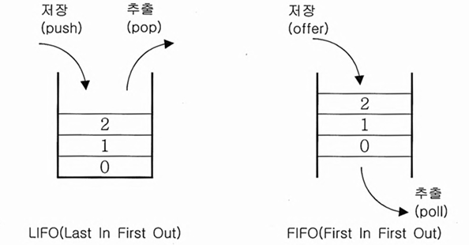
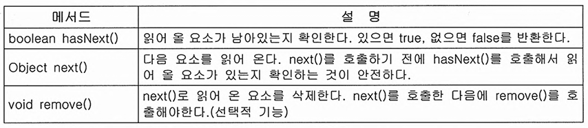
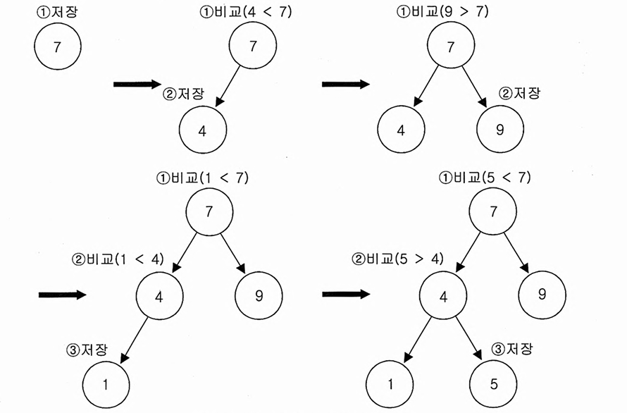
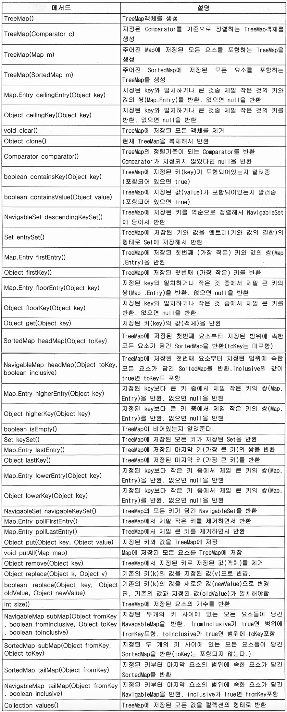
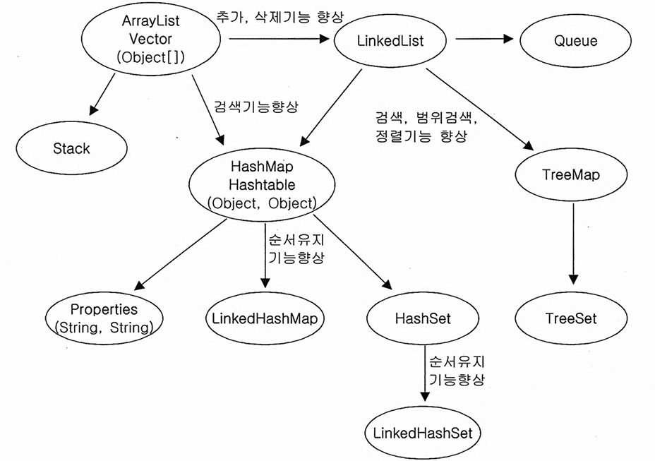
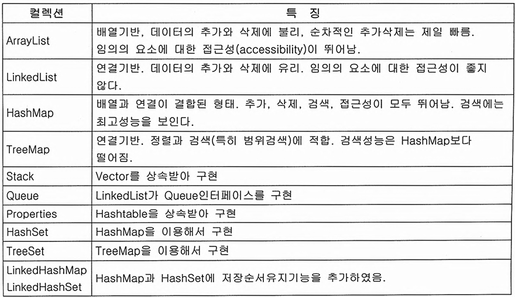

# 컬렉션 프레임워크

> ## Index
> #### 1. 컬렉션 프레임워크와 핵심인터페이스
> #### 2. ArrayList & LinkedList
> #### 3. Stack & Queue
> #### 5. 열거형
> #### 6. Arrays
> #### 7. Comparator, Comparable
> #### 8. HashSet
> #### 9. TreeSet
> #### 10. HashMap & HashTable
> #### 11. TreeMap
> #### 12. Properties
> #### 13. Collections
> #### 14. 정리 및 요약

  

## 1. 컬렉션 프레임워크와 핵심인터페이스

#### 1-1. 컬렉션 프레임워크란
* 다수의 데이터를 쉽고 효과적으로 처리할 수 있는 표준화된 방법을 제공하는 클래스의 집합.
    - 자료구조와 데이터를 처리하는 알고리즘을 구조화하여 클래스로 인터페이스를 사용하여 구현해놓은 것을 의미한다.
#### 1-2. 핵심 인터페이스
* 컬렉션 프레임워크에서는 자료구조의 형태에따라 크게 3가지의 형태로 분류하고 있다.
    - List, Set, Map  
        세가지의 자료구조 형태가 있는데 이중 List와 Set의경우 공통된 부분이 많아 Collection을 공통된 부모로 상속받고있다.
* Collection
    - Collection의 메서드들은 `저장된 데이터를 읽거나 추가 또는 삭제하는등의 기본적인 메서드`들을 가지고있다.(하단 이미지 참조)
    - 반환타입이 Boolean인 메서드들은 작업을 성공할경우 true, 실패하면 false를 반환한다.
    - 또한 표에서 들어간 Object가 E, T, K, V등이 들어가있는 경우도 있는데 지네릭스에 의한 표기로 일단 Object타입으로 이해하고 있으면 된다.
    - 
* List
    - `순서가 있는` 데이터의 집합, 데이터의 중복을 허용한다.  
    class) ArrayList, LinkedList, Stack, Vector등
    - 저장순서가 유지되며, 중복을 허용해야할경우 사용한다.
    - 
    ``` java
    ArrayList<Object> list = new ArrayList<Object>();
    ```
* Set
    - `순서가 없는` 데이터의 집합, `중복을 허용하지 않는다.`  
    class) HashSet, TreeSet등
    - 중복을 허용하지 않고 저장순서가 상관없을경우 사용한다.
    ``` java
    Set<Object> getSet = new HashSet<>();
    ```
* Map
    - `key와 value의 쌍`으로 이루어진 데이터의 집합
    - 순서가 없으며 key는 중복을 허용하지 않고, value는 중복된 값이 들어갈 수 있다. 
    - 만약 중복된 key로 값을 저장 할 경우 마지막에 할당한 값이 저장된다. 
    class) HashMap, TreeMap, HashTable, Properties등
    - 
    - values()에서는 map의경우 value값은 중복을 허용하기 때문에 collection타입으로 반환하고  
    keySet()에서는 key는 중복을 허용하지 않기때문에 set타입으로 반환한다. 
    ``` java
    Map<String, Object> resMap = new HashMap<String, Object>();
    ```
* Map과 Set을 이용한 맵 객체의 값 찾기
``` java 
public static void main(String[] args) {
    
    Map<String, Object> resMap = new HashMap<String, Object>();
    resMap.put("name", "김철수");
    resMap.put("age", "25");
    resMap.put("number", "010-1234-5566");
    resMap.put("e-mail", "kcs@maver.com");
    
    Set<String> getKey = resMap.keySet();
    Iterator<String> getItr = getKey.iterator();
    
    while (getItr.hasNext()) {
        String key = getItr.next();
        Object value = resMap.get(key);
        System.out.println("키의 값은 " + key + "이고 벨류의 값은 " + value + "입니다.");
        /* 결과값 : 
        키의 값은 number이고 벨류의 값은 010-1234-5566입니다.
        키의 값은 name이고 벨류의 값은 김철수입니다.
        키의 값은 e-mail이고 벨류의 값은 kcs@maver.com입니다.
        키의 값은 age이고 벨류의 값은 25입니다.
        */
    }
}
```
* 각 자료구조마다의 특성이 다르기때문에 필요로하는 컬렉션의 특징을 잘 파악하고 적절한 자료구조를 사용햐야한다.
* Vector, Stack, HashTable, Properties와 같은 클래스는 컬렉션프레임워크가 만들어진 이전부터 사용되던  
    자료구조이기 때문에 호환을 위해 남겨졌지만 가능하면 사용하지 않는것이 좋다고 한다. (성능면에서도 우수하다고한다.)

  

## 2. ArrayList & LinkedList
### 2-1. ArrayList
* ArrayList는 List의 인터페이스를 구현하기 때문에 데이터의 저장순서가 유지되고 중복을 허용한다는 특징이 있다.
* ArrayList는 Object배열을 이용하여 데이터를 순차적으로 저장한다.
    - 만약 데이터를 더이상 저장할 공간이 없다면 보다 큰 새로운 배열을 생성하여 기존 배열에 저장된 내용을 새로운 배열로 복사한 다음 저장된다.
    - 이때 기존의 인스턴스를 재사용하는것이 아니라 새로운 인스턴스를 만드는것에 주의해야한다.
    - 또한 용량을 변경해야 할경우 효율이 상당히 떨어지기때문에 저장할 데이터의 갯수를 잘 고려하여 충분한 용량의 인스턴스를 생성하는것이 좋다.
* 기본형인 Array`String[] arr = new String[3];`과 다른점은 길이가 지정되어있지 않고, 데이터의 추가가 자유롭다는 점이다.  
    만약 데이터의양이 동적으로 변화되는 경우라면 List를 사용하는 것이 바람직하다.
``` java 
public static void main(String[] args) {
    
    ArrayList<Object> arrList1 = new ArrayList();
    ArrayList<Object> arrList2 = new ArrayList();
    arrList1.add("a");	
    arrList1.add("c");	
    arrList1.add("b");	
    arrList1.add("d");
    arrList2.add("c");
    arrList2.add("d");
    arrList2.add("f");

    System.out.println(arrList1);   // 결과값 : [a, c, b, d]
    System.out.println(arrList2);   // 결과값 : [c, d, f]

    System.out.println(arrList1.retainAll(arrList2));   // 결과값 : true (값에 변화가 있었기때문에 true로 return)

    System.out.println(arrList1);   // 결과값 : [c, d] (공통된부분이 삭제되었다.)
    System.out.println(arrList2);   // 결과값 : [c, d, f]   
}

```
* ArrayList의 메서드들

``` java
public static void main(String[] args) {
    
    ArrayList<Object> arrList1 = new ArrayList();
    arrList1.add("a");	
    arrList1.add("c");	
    arrList1.add("b");	
    arrList1.add("d");
    
    // List의 마지막부터 데이터를 지우기
    for (int cnt = arrList1.size() -1; cnt >= 0; cnt--) {
        arrList1.remove(cnt);
        System.out.println(arrList1);   // 결과값 : [a, c, b] / [a, c] / [a] / []
    }
}
```
* 리스트의 마지막부터 데이터를 지울경우 System.arraycopy()를 호출하지 않기 때문에 작업시간이 짧게 걸린다.

  

### 2-1. LinkedList
* 배열은 자료구조가 간단하고 사용하기 쉬우며 데이터를 읽어오는데 걸리는 시간이 적다는 장점을 가지고 있지만, 아래와 같은 단점을 가지고있다.
    - 크기를 변경할 수 없다.  
        크기를 변경활 수 없으므로 새로운 배열을 생성해서 데이터를 복사하는 작업이 필요하다.
    - 비순차적인 데이터의 추가 또는 삭제에 시간이 많이 걸린다.  
        차례대로 데이터를 추가하고 마지막부터 삭제하는것은 빠르지만 배열의 중간에 데이터를 추가하려고 한다면 다른데이터를 복사해서 이동해야하기 때문이다.
* 위와같은 배열의 단점을 보완하기 위하여 LinkedList라는 자료구조가 고안되었다.
* 배열은 모든 데이터가 연속적으로 존재하지만 LinkedList는 비연속적인 데이터를 서로 연결하는 형태로 구성되어있다.

* 위와같이 LinkedList의 각 요소들은 자신과 연결된 다음요소에대한 참조값과 데이터로 구성되어있다.
* LinkedList는 참조값으로 이루어져있기 때문에 참조만 변경하면 삭제/추가의 작업이 이루어진다.  
    따라서 배열처럼 데이터를 이동하기 위해 복사하는 과정이 없기때문에 처리속도가 매우빠르다.
* 다만 LinkedList는 이동방향이 단방향으로 이루어져있기 때문에 다음요소에 대한 접근은 쉽지만 이전요소에 대한 접근은 어렵다.  
    이점을 보완한것이 double Linked List(이중연결리스트)이다.
    - double Linked List는 참조변수를 하나 더 추가하여 다음요소에 대한 참조와 이전요소에 대한 참조가 가능하도록 변경한 것일뿐 다른것은 LinkedList와 동일하다.
    - double Linked List는 각 요소에 대한 접근이 용이하기 때문에 LinkedList보다 더 많이 사용된다.
    - 또한 요소에 대한 접근성을 좀더 향상시킨 방법이 double circular Linked List인데 리스트의 첫번째 요소와 마지막 요소를 서로 연결시킨 형태로 LinkedList클래스는 낮은 접근성을 높이기 위해 해당 방법으로 구성되어있다.

* LinkedList또한 List의 인터페이스를 구현했기 때문에 제공하는 메서드의 종류와 기능은 거의 같다.
* LinkedList는 불연속적으로 위치한 요소들이 연결된 것이므로 데이터의 갯수가 많아질수록 데이터를 읽어오는 시간(접근시간)이 길어진다는 단점이 있다.


  
## 3. Stack & Queue

* Stack
    - LIFO(Last in First out)구조로 되어있다.
    - 넣은 순서와 꺼내는 순서가 반대로 된다.
    - 마지막에 넣은 요소가 삭제되기 때문에 Stack을 클래스로 구현한다면 ArrayList로 구현하는것이 바람직하다.
    
    - Stack은 컬렉션 프레임워크가 나오기 전부터 존재했기 때문에 ArrayList가 아닌 Vector를 상속받아 구현되었다.
* Queue
    - FIFO(First in First out)구조로 되어있다.
    - 넣은 순서와 꺼내는 순서가 동일하다.
    - 처음요소가 삭제되기때문에 ArrayList로 구현할경우 빈공간을 채우기 위해 복사가 이루어지므로 비효율적이게 된다. 따라서 LinkedList로 구현하는것이 바람직하다.
    
* Stack과 Queue의 꺼내지는 순서
``` java
public static void main(String[] args) {
    
    Stack<String> stack = new Stack<>();
    Queue<String> queue = new LinkedList<>();
    // Queue는 클래스로 제공되지 않기때문에 인터페이스를 구현한 구현체를 사용하였다.
    
    stack.push("a");
    stack.push("b");
    stack.push("c");
    queue.offer("a");
    queue.offer("b");
    queue.offer("c");
    
    System.out.print("stack : ");
    while (!stack.isEmpty()) {
        System.out.print(stack.pop());  // 결과값 : stack : cba
    }
    System.out.println();

    System.out.print("queue : ");
    while (!queue.isEmpty()) {
        System.out.print(queue.poll()); // 결과값 : queue : abc
    }
}
```
* 나만의 Stack 만들기
``` java
public class Test {
	
	public static void main(String[] args) {
		
		NewStack newStack = new NewStack();
		
		newStack.add(1);
		newStack.add(3);
		
		System.out.println(newStack.pop());
	}
}

class NewStack extends Vector {
	
	public Object push(Object item) {
		addElement(item);
		
		return item;
	}
	
	public Object pop() {
		Object item = peek();
		removeElementAt(size() - 1);
		
		return item;
	}
	
	public Object peek() {
		int leng = size();
		if (0 == leng)  throw new EmptyStackException();    // Stack이 비어있으면 익셉션을 발생시킨다.
		
		return elementAt(leng - 1);
	}
	
	public boolean isEmpty() {
		return size() == 0;
	}
	
	public int search(Object item) {
		int lastIndex = lastIndexOf(item);
		
		return (lastIndex >= 0) ? size() - lastIndex : -1;  // 해당 객체가 있을경우 그 객체의 index를 반환하고 없을경우 -1을 반환한다.
	}
}
```
* 웹브라우저의 이동을 Stack으로 구현하기
``` java
public class Test {
	
	public static void main(String[] args) {
		
		UseUrl useUrl = new UseUrl();
		
		useUrl.goUrl("네이버");
		useUrl.goUrl("다음");
		useUrl.goUrl("카카오");
		useUrl.printStatus();
		
		useUrl.goBack();
		useUrl.printStatus();
		
	}
}

class UseUrl {
	
	private static Stack back;
	private static Stack front;
	
	public UseUrl() {
		back = new Stack();
		front = new Stack();
	}
	
	public void printStatus() {
		System.out.println("back : " + back);
		System.out.println("front : " + front);
		System.out.println("현재 페이지는 : " + back.peek() + "입니다.");
	}
	
	public void goUrl(String url) {
		back.push(url);
		
		if (!front.isEmpty()) front.clear();
	}
	
	public void goFront() {
		
		if (!front.isEmpty()) back.push(front.pop());
	}
	
	public void goBack() {
		
		if (!back.isEmpty()) front.push(back.pop());
	}
}
```
* PriorityQueue
    - Queue인터페이스의 구현체 중 하나로서 저장한 순서에 상관없이 우선순위가 높은 것부터 꺼낸다는 특징이 있다.
    - null을 저장할 수 없고 null을 저장할경우 NullPointException이 발생한다.
    - 저장공간을 배열로 사용하고 각 요소를 힙(Heap)이라는 자료구조의 형태로 저장한다.
    - 힙이란 이진트리의 한 종류로 가장 큰 값이나 가장 작은 값을 빠르게 찾을 수 있다는 특징이 있다.  
        (JVM의 힙과는 다른것)
    - 아래와같이 넣은 순서가 아닌 숫자의 크기대로 거내지는것을 볼 수 있다.
```java
public class Test {
	
	public static void main(String[] args) {
		
		Queue pq = new PriorityQueue<>();
		
		pq.offer(3);
		pq.offer(1);
		pq.offer(8);
		pq.offer(2);
		
		System.out.println(pq); // 결과값 : [1, 2, 8, 3]

		Object num = null;
		
		while ((num = pq.poll()) != null) {
			System.out.println(num);    // 결과값 : 1,2,3,8이 순서대로 찍힘.
		}
	}
}
```
* Dequeue(덱, 디큐)
    - Queue의 변형으로 Queue와는 다르게 양쪽에서 추가 및 삭제가 가능하다.
    - Queue를 상속받았으며, 구현체로는 ArrayDeque와 LinkedList등이 있다.

<br />

## 5. 열거형 인터페이스 (Iterator ListIterator, Enumeration)
* 컬렉션에 저장된 요소에 접근하는 방법을 표준화한 인터페이스이다.
* Enumeration은 Iterator의 구버전이고 ListIterator는 Iterator의 기능을 향상시킨 것이다.
* Iterator
    - Collection 인터페이스에는 Iterator를 반환하는 메서드 iterator()를 정의하고 있다.  
        List와 Set은 Collection의 자손이므로 iterator()가 각 특성에 맞게 정의되어있다.
    - iterator()를 사용하여 얻은 Iterator객체는 주로 while반복문을 통하여 각 요소를 읽어올 수 있다.
    - 컬렉션 요소를 읽어오는 방법을 공통 인터페이스를 이용하여 표준을 정의하고 구현하여  
        코드의 일관성을 유지하고 재사용성을 극대화하는 것이 객체지향 프로그래밍의 중요한 목적중 하나라고 한다.

``` java
public class Test {
	
	public static void main(String[] args) {
		
		List arr = new ArrayList<>();   // 다른 컬렉션으로 변경할경우 이부분만 수정하면 된다.
		Iterator iter = arr.iterator();
		
		while (iter.hasNext()) {
			System.out.println(iter.next());
		}
	}
}
```
*   - Map 인터페이스는 key와 value를 쌍으로 가지고 있기 때문에 iterator()를 직접 호출할 수 없고,  
        대신 keySet()또는 entrySet()과 같은 메서드를 통해서 키와 값을 따로 Set의 형태로 얻어온 후  
        다시 iterator()를 호출해야 Iterator객체를 얻을 수 있다.
    - 아래와 같이 keySet()에 iterator()를 붙여서 쓸 수 있는이유는 keySet이 Set객체를 리턴하기 때문이다.
    - List클래스는 저장한 순서를 유지하기 때문에 Iterator를 이용해서 읽어온 결과 역시 저장순서와 동일하지만  
        Set의 경우 요소간 순서가 유지되지 않기 때문에 Iterator를 이용해서 읽어온 결과 역시 저장순서와 다르다.
``` java
public class Test {

    public static void main(String[] args) {

        Map map = new HashMap();
        Iterator itr = map.keySet().iterator();
    }
}
```
* Enumeration
    - Enumeration은 컬렉션 프레임워크가 만들어지기 이전에 사용하던것으로 Iterator의 구버전이라고 생각하면 된다.
    - 이전버전으로 사용된 소스와의 호환을 위해서 남겨진것으로 최대한 Iterator을 사용헤야한다고 한다.

* ListIterator
    - Iterator를 상속받아서 기능을 확장한 것으로 컬렉션 요소에 접근할 때 Iterator는 단방향으로만 이동할 수 있는데 반해  
        ListIterator는 양방향으로의 이동이 가능하다.
    - 다만, ArrayList또는 LinkedList와 같이 List인터페이스를 구현한 컬렉션에서만 사용가능하다.
``` java
public class Test {
	
	public static void main(String[] args) {
		
		List list = new ArrayList();

		list.add(1);
		list.add(2);
		list.add(3);
		list.add(4);
		list.add(5);
		
		ListIterator iter = list.listIterator();
		
		while(iter.hasNext()) {
			System.out.println(iter.next());    // 결과값 : 1,2,3,4,5
		}
		
		while (iter.hasPrevious()) {
			System.out.println(iter.previous());    // 결과값 : 5,4,3,2,1
		}
	}
}
```

*   - 메서드 중에서 선택적기능이라고 적힌것은 반드시 구현하지 않아도 된다.
    - 다만 인터페이스로 상속받은 메서드는 추상메서드라 메서드의 구현부를 반드시 만들어주어야 하기 때문에 아래와 같이 처리한다고 한다.
``` java
public void remove() {
    throw new UnsupportedOperationException();
}
```
*   - 단순히 빈 구현부를 만들어주는 것보다 예외를 던져서 구현되지 않은 메서드라는것을 알려주는것이 좋다고 한다.  
        그렇지 않을경우 사용하는쪽에서 소스를 구현해보기 전까지는 이 기능이 바르게 동작하는지의 여부를 알 수 없기 때문이다.
    - Java API문서에서도 remove()메서드의 상세내용을 보면 메서드를 지원하지 않는 Iterator의 경우  
        UnsupportedOperationException을 발생시킨다고 쓰여있다.  
        이는 remove를 구현하지 않을경우 UnsupportedOperationException를 발생시키도록 구현하라는 뜻이다.
    - Iterator의 remove의 경우 단독으로 사용할 수 없고, next()와 같이 사용해야 한다.  
        이는 특정요소를 삭제하는 것이 아닌 next()로 읽어온 것을 삭제하기 때문이다.  
        띠라서 next()의 호출없이 remove()를 사용할 경우 IllegalStateException이 발생한다.
```java
public class Test {
    public static void main(String[] args) {

        List orgArr = new ArrayList<>();
		List cpArr = new ArrayList<>();
		
		for (int i = 1; i <= 10; i++) orgArr.add(i);
		
		Iterator itr = orgArr.iterator();
		
		System.out.println("복사전 원래의 배열 : " + orgArr);   // 결과값 : [1, 2, 3, 4, 5, 6, 7, 8, 9, 10]
		
		while (itr.hasNext()) {
			cpArr.add(itr.next());  // 이부분을 지울경우 Exception이 발생한다.
			itr.remove();
		}
		System.out.println("원래의 배열 : " + orgArr);   // 결과값 : []
		System.out.println("복사된 배열 : " + cpArr);    // 결과값 : [1, 2, 3, 4, 5, 6, 7, 8, 9, 10]
    }
}
```


<br />

## 6. Arrays
* 배열을 다루는데 유용한 메서드들이 정의되어있다. (모든 메서드는 satatic으로 선언되어있다.)
* 배열의 복사 : copyOf(), copyOfRange()
    - copyOf는 배열의 전체를, copyOfRange는 배열의 일부를 복사하여 새로운 배열로 반환한한다.  
        copyOfRange에 지정된 범위의 끝은 포함되지 않는다.
``` java
public class Test {
	
	public static void main(String[] args) {
		
		int[] arr = {1,2,3,4,5};
		int[] arr2 = Arrays.copyOf(arr, arr.length);    // 결과값 : 1,2,3,4,5
		int[] arr3 = Arrays.copyOfRange(arr, 2, 4);     // 결과값 : 3.4
	}
}
```
* 배열채우기 : fill(), setAll()
    - fill은 모든 요소를 지정된 값으로 채운다.
    - setAll은 배열을 채우는데 사용할 함수형 인터페이스를 매개변수로 받는다.  
        이 메서드를 호출할 때는 함수형 인터페이스를 구현한 객체를 매개변수로 지정하거나 람다식을 지정해야 한다.
``` java
public class Test {
	
	public static void main(String[] args) {
		
		int[] arr = new int[5];
		Arrays.fill(arr, 5);    // 결과값 : 5,5,5,5,5
		Arrays.setAll(arr, i -> (int) (Math.random() * 5) + 1); // 결과값 : 랜덤한 정수 5개
	}
}
```
* 배열의 정렬과 검색 : sort(), binarySearch()
    - sort는 배열을 정렬할 때, binarySearch는 배열에 저장된 요소를 검색할때 사용한다.
    - 다만 binarySearch는 배열에서 지정된 값이 저장된 위치(index)를 찾아서 반환하는데,  
        반드시 배열이 정렬된 상태여야 올바를 결과를 얻을 수 있다.  
        그리고 검색한 값과 일치하는 요소가 여러개가 있다면 어떤것의 위치가 반환될지는 알 수 없다.
    - 배열의 첫번째 요소부터 순서대로 하나씩 검색하는 것을 순차검색(linear search)이라고 하는데  
        이 방식은 배열이 정렬되어있을 필요는 없지만 검색하는데 많은 시간을 필요로한다.  
        반면에 이진검색(binart search)은 배열의 검색할 범위를 반복적으로 절반씩 줄여가면서 검색하기 때문에  
        검색속도가 빠르지만 배열이 정렬되어있어야 한다는 단점도 있다.
``` java
public class Test {
	
	public static void main(String[] args) {
		
		int[] arr = {1,4,3,2,5};
		
		System.out.println(Arrays.binarySearch(arr, 2));    // 결과값 : -2
		Arrays.sort(arr);   // sort를 이용하여 배열을 재정렬, 결과값 : [1, 2, 3, 4, 5]
		System.out.println(Arrays.binarySearch(arr, 2));    // 결과값 : 1
	} 
}
```
* 문자열의 비교와 출력 : equals(), toString()
    - toString은 모든 요소를 문자열로 출력할 수 있다. 다만 일차원의 배열에만 사용할 수 있으므로  
        다차원 배열에서는 deepToString()을 사용해야 한다.
    - deepToString의 경우 배열의 모든 요소를 재귀적으로 접근해서 문자열을 구성하므로 2차원 뿐만아니라  
        다차원의 배열에서도 동작한다.
    - equals는 두 배열에 저장된 모든 요소를 비교하여 같으면 true, 다르면 false를 반환한다.  
        equals도 일차원의 배열에서만 사용가능하므로, 다차원 배열의 비교에서는 deepEquals()를 사용해야 한다.
    - 다차원의 배열을 equals로 비교할 경우 배열의 문자열을 비교하는것이 아닌 배열의 주소값을 비교하기  
        때문에 결과는 false로 나온다.
``` java
public class Test {
	
	public static void main(String[] args) {
		
		// 일차원 배열
		int[] arr = {1,4,3,2,5};
		int[] arr2 = {1,4,3,5,5};

		System.out.println(Arrays.toString(arr));	// 결과값 : [1, 4, 3, 2, 5]
		System.out.println(Arrays.equals(arr, arr2));	// 결과값 : false
		
        // 다차원 배열
		int[][] deepArr = {{1,3,4}, {3,4,5}, {2,6,8}};
		int[][] deepArr2 = {{1,3,4}, {3,4,5}, {2,6,8}};

		System.out.println(Arrays.deepToString(deepArr));	// 결과값 : [[1, 3, 4], [3, 4, 5], [2, 6, 8]]
		System.out.println(Arrays.equals(deepArr, deepArr2));	// 결과값 : false
		System.out.println(Arrays.deepEquals(deepArr, deepArr2));	// 결과값 : true
	}
}
```
* 배열을 List로 변환 : asList(Object... a)
    - asList는 배열을 List에 담아 반환한다.  
        매개변후 타입이 가변인수이기때문에 배열의 생성없이 저장할 요소들만 나열하는것도 가능하다.
    - 다만 asList가 반환한 List의 크기를 변경할 수 없으므로 저장된 요소의 변경이 아닌 추가 및 삭제는 불가능하다.  
        만일 크기를 변경할 수 있는 List가 필요하다면 새로운 List객체를 생성하면 된다.
``` java
public class Test {
	
	public static void main(String[] args) {
		
        // 크기변경이 불가능한 asList
		List<Integer> list1 = Arrays.asList(1, 2, 3, 4, 5);
		list1.add(6);	// Exception 발생
		
        // 크기 변경 가능한 asList
		List<Integer> list2 = new ArrayList<>(Arrays.asList(1, 2, 3, 4, 5));
		list2.add(6);
	}
}
```
* 가변인수
    - 가변인수란 필요에따라 매개변수(인수)를 가변적으로 조정할 수 있는것을 말한다.
    - 가변인수를 선언할 때 `...`을 붙이면 컴파일러가 매개변수/인자를 배열로 만들어서 처리해준다.
    - 가변인수를 사용하는경우 오버로딩을 해야할 경우 주의해야 하고, 인수를 여럭개 사용할 경우 가변인수는 마지막에 정의해야 한다.
``` java
public class Test {
	
	public static void main(String[] args) {
		
		Test2 test2 = new Test2();
		test2.show("메롱", "입니", "다아", "아아");
	}
}

class Test2 {
	public void show(String... strings) {
		
		for (String str : strings) {
			System.out.println(str);    // 결과값 : 메롱, 입니, 다아, 아아
		}
	}
}
```
* perallelXXX(), spliterator(), stream()
    - 이외에도 'perallel'로 시작되는 이름의 메서드들이 있는데, 이 메서드는 보다 빠른 결과를 얻기 위해서  
        여러 쓰레드로 작업을 나누어 처리하도록 한다.
    - spliterator는 여러 쓰레드가 작업할 수 있도록 하나의 작업을 여러개의 작업으로 나누는 Spliterator를  
        반환하며 stream은 컬렉션을 stream으로 변환한다.
    - 이 메서드들은 14장 람다와 스트림에서 더 자세하게 나온다고 한다.


<br />

## 7. Comparator, Comparable
* 컬렉션을 정렬하는데 필요한 메서드를 정의하고 있는것으로 앞서 사용한 sort()또한 Comparable의 구현을 통하여  
    정렬되었던 것이다.
* Comparable을 구현하고있는 클래스들은 같은 타입의 인스턴스끼리 서로 비교할 수 있는 클래스들이며  
    기본적으로 오름차순으로 정렬되도록 구현되어있다.  
    따라서 Comparable를 구현한 클래스는 정렬이 가능하다. (JavaAPI문서에 Comparable를 구현한 클래스를 찾아볼 수 있다.)
* Comparator와 Comparable의 실제소스
```java
public final class Integer extends Number implements Comparable<Integer> {
    ...
    public interface Comparator {
        int compare(Object o1, Object o2);
    }
    public interfece Comparable {
        public int compareTo(Object o);
    }
    ...
}
```
* compare와 compareTo는 선언형태와 이름이 약간 다를뿐 두 객체를 비교하는 기능을 목적으로 설계되었다.  
    해당 메서드의 반환값은 int지만 실제로는 비교하는 두 객체가 같으면 0, 비교하는 값보다 작으면 음수,  
    비교하는 값보다 크면 양수를 반환하도록 구현해야 한다.
* Integer클래스의 Comparable의 compareTo() 구현
``` java
public int compareTo(Integer anotherInteger) {
    return compare(this.value, anotherInteger.value);
}
public static int compare(int x, int y) {
    return (x < y) ? -1 : ((x == y) ? 0 : 1);   // x가 y보다 작으면 -1, 같으면 0, 크면 1을 반환한다.
}
```
* Comparable을 구현한 클래스들이 기본적으로 오름차순으로 정렬되어 있지만, 내림차순 또는 다른 정렬 기준을  
    적용하고 싶을 때 Comparator를 구현하여 새로운 정렬기준을 제공할 수 있다.
    - Comparable : 기본 정렬을 구현하는데 사용
    - Comparator : 기본 정렬기준 외 다른 기준을 적용할 때 사용
* Comparator을 구현하여 새로운 정렬 기준을 적용하는 예제
``` java


public class Test {
	
	public static void main(String[] args) {
		
		String[] strArr = {"Dog", "Cat", "Banana", "apple", "Lion"};
		
        // String의 Comparable에 의한 오름차순 정렬
		Arrays.sort(strArr);
		System.out.println(Arrays.toString(strArr));    //  결과값 : [Banana, Cat, Dog, Lion, apple]
		
        // 대소문자를 구별하지 않은 정렬
		Arrays.sort(strArr, String.CASE_INSENSITIVE_ORDER);
		System.out.println(Arrays.toString(strArr));    // 결과값 : [apple, Banana, Cat, Dog, Lion]
		
        // Comparator을 상속받은 Test2를 이용한 내림차순 정렬
		Arrays.sort(strArr, new Test2());
		System.out.println(Arrays.toString(strArr));    // 결과값 : [apple, Lion, Dog, Cat, Banana]
	}
}

class Test2 implements Comparator {

	@Override
	public int compare(Object o1, Object o2) {
		
		if (o1 instanceof Comparable && o2 instanceof Comparable) {
            /*
                compare의 경우 매개변수가 Object타입이기때문에 compareTo()를 사용할 수 없으므로 
                Comparable타입으로 형변환을 해주었다.
            */
			Comparable c1 = (Comparable) o1;
			Comparable c2 = (Comparable) o2;
			
            // 내림차순 정렬을 위해 -1을 곱해준다. c1과 c2의 위치를 바꿔도 동일한 값을 얻을 수 있다.
			return c1.compareTo(c2) * -1;
		}

		return -1;
	}
}
```


<br />

## 8. HashSet
* HashSet은 Set인터페이스를 구현한 대표적인 컬렉션이다. 때문에 Set인터페이스의 특징대로 중복된 요소를 저장하지 않는다.
* 새로운 요소를 추가할 때는 add()또는 addAll()메서드를 이용하는데, 만일 중복된 요소를 추가하고자 한다면 false를  
    반환하므로 추가에 실패했다는것을 알린다.  
    위와같은 HashSet의 특징을 이용한다면 컬렉션 내의 중복요소들을 쉽게 제거할 수 있다.
* List인터페이스를 구현한 컬렉션과 달리 HashSet은 저장순서를 유지하지 않기때문에 저장순서를 유지하고자 할 경우  
    LinkedHashSet을 사용해야 한다.

```java
public class Test {
	
	public static void main(String[] args) {
		
		int[] arr = {3, 3, 2, 2, 1, 6, 6, 5};
		Set set = new HashSet<>();
		
		for (Integer a : arr) {
			set.add(a);
		}
		System.out.println(set);    // 결과값 : [1, 2, 3, 5, 6] 저장된 순서가 유지되지 않는다.
	}
}
```
* LinkedHashSet을 이용한 빙고판 만들기
```java
public class Test {
	
	public static void main(String[] args) {
		
		Set<Integer> set = new LinkedHashSet<>();   // 저장된 순서를 유지하기 위해 LinkedHashSet을 사용
		
		for (int i = 0; set.size() < 25; i++) {
			set.add((int) ((Math.random() * 50) + 1));
		}
		
		Iterator iter = set.iterator();
		
		int[][] arr = new int[5][5];    // 빙고판이 될 배열
		int totalLen = arr.length;
		int eachLen = arr[0].length;
		
		for (int i = 0; i < totalLen; i++) {
			for (int j = 0; j < eachLen; j++) {
				
				arr[i][j] = (int) iter.next();
				iter.remove();
				
				System.out.print( (arr[i][j] < 10) ? " 0" + arr[i][j] + " " : " " + arr[i][j] + " ");
			}
			System.out.println();
		}
	}
}
```
* HashSet의 add메서드는 새로운 요소를 추가하기 전에 기존에 저장된 요소인지를 확인하기 위해  
    추가하려는 요소의 equals와 hashCode를 호출하기 때문에 equals와 hashCode를 목적에 맞게 오버라이딩 해야한다.  
    JDK 1.8부터는 Object클래스의 hash()를 이용하면 된다.
    - 오버라이딩 된 hashCode는 몇가지의 조건을 만족시켜야 한다.
        + 동일한 객체내에서 여러번 hashCode를 호출해도 동일한 값을 반환해야 한다.  
            (단 Object클래스의 hash()의경우 주소값을 반환하므로 값이 서로 다를 수 있다.)
        + equals가 true를 반환한 두 객체의 hashCode값은 동일해야한다.
        + equals가 false를 반환한 두 객체의 hashCode값이 동일해도 되지만, 해싱(Hashing)을 사용하는 컬렉션의  
            성능을 향상시키기 위해서는 다른 int값을 반환하는것이 좋다.  
            (중복되는 결과가 많아질경우 HashTable, HashMap과 같은 컬렉션의 검색속도가 떨어진다.)
``` java
public class Test {
	
	public static void main(String[] args) {
		
		HashSet hSet = new HashSet<>();
		
		hSet.add(new AddPerson("차차차", 20));
		hSet.add(new AddPerson("차차차", 20));
		
        /*
            결과값 : [차차차 : 20]
            만약 AddPerson클래스의 equals(), hashCode()를 주석처리할경우
            같은내용임에도 불구하고 중복된 값이 들어가게 된다. [차차차 : 20, 차차차 : 20]
        */
		System.out.println(hSet.toString());
	}
}

class AddPerson {
	
	private String name;
	private int age;
	
	public AddPerson(String name, int age) {
		this.name = name;
		this.age = age;
	}
	
	public boolean equals(Object obj) {
		
		Boolean result = false;
		
		if (obj instanceof AddPerson) {
			AddPerson tmp = (AddPerson) obj;
			
			result =  name.equals(tmp.name) && age == tmp.age;
		}
		return result;
	}
	
	public int hashCode() {
		return Objects.hash(name, age);
	}
	
	public String toString() {
		return name + " : " + age;
	}
}
```


<br />

## 9. TreeSet
* TreeSet은 이진 검색트리(binary search tree)라는 자료구조의 형태로 데이터를 저장하는  
    클래스이다.
* 이진 검색트리는 정렬, 검색, 범위검색에 높은 성능을 보이는 자료구조이며, TreeSet은 이진 검색트리의  
    성능을 향상시킨 레드-블랙트리(Red-Black tree)로 구현되어 있다.
* Set인터페이스를 구현했기 때문에 중복된 데이터의 저장을 허용하지 않으며 정렬된 위치에 저장하므로  
    저장순서를 유지하지도 않는다.
* 이진트리의 경우 LinkedList와 같이 여러개의 노드가 서로 연결된 구조로 각 노드에 최대 2개의 노드를  
    연결할 수 있으며 루트(root)라고 불리는 하나의 노드에서부터 시작되어 확장해 나갈 수 있다.
    - 위 아래로 연결된 두 노드를 부모-자식관계에 있다고 하며, 이 부모-자식관계는 상대적인 관계이다.

* 이진 검색트리(binary search tree)
    - 부모노드의 왼쪽에는 부모노드의 값보다 작은값의 자식노드를, 오른쪽에는 부모노드보다 큰값의 자식노드를  
        저장하는 이진트리이다.
    - 모든 노드는 최대 2개의 자식노드를 가질 수 있다.
    - 노드의 추가 및 삭제에 시간이 걸린다. (순차적으로 저장하지 않기 때문에)
    - TreeSet은 정렬된 상태를 유지하기 때문에 단일값 및 범위 검색, 정렬에 유리하다.
    - 중복된 값을 저장하지 못한다.
    - 왼쪽 마지막값부터 오른쪽 마지막 값까지의 값을 `왼쪽노드 > 루트 > 오른쪽노드` 순서로 읽었을 때  
        오름차순으로 정렬된 순서를 얻을 수 있다.
    - 저장된 값의 갯수제 비해서 검색시간이 증가하지만, 검색효율이 뛰어난 자료구조이다.
* 이진 검색트리의 저장방식
    - 첫번째 저장하는 값은 루트가 되고 두번째 값부터 작은값은 왼쪽에, 큰값은 오른쪽에 저장이 된다.
    - 이렇게 트리를 구성할경우 왼쪽 마지막 레벨이 제일 작은값이 되고 오른쪽 마지막 레벨은 제일 큰 값이된다.
    - 컴퓨터는 알아서 값을 비교하지 못하기때문에 Comparable을 구현하거나 Comparator을 제공해서 두 값을  
        비교할 방법을 제공해줘야 한다. 그렇지 않을경우 두번째 객체를 저장할 때 Exception이 발생한다.


``` java
public class Test {
	
	public static void main(String[] args) {
		
		TreeSet<Integer> nSet = new TreeSet<>();
		
		for (int i = 0; nSet.size() < 10; i++) {
			nSet.add((int)(Math.random() * 25) + 1);
		}

		System.out.println(nSet);   // 랜덤으로 저장된 10개의 정수
		System.out.println(nSet.headSet(20));   // 그중 20보다 작은수가 출력
		System.out.println(nSet.tailSet(15));   // 그중 15보다 큰수가 출력
	}
}
```

<br />

## 10. HashMap & HashTable
* HashTable은 Vector와 같이 호환을 위해 남겨놓은 것으로 HashMap을 사용해야 한다고 한다.
* HashMap은 Map을 구현해서 값이 key와 value로 구성된 하나의 묶음을 데이터로 저장한다는 특징이 있다.
* Hashing을 이용하기 때문에 많은 양의 데이터를 검색하는데 있어서 뛰어난 성능을 보인다.
* HashMap의 실제 구현 소스는 Entry라는 내부 클래스를 정의하고 다시 Entry타입의 배열을 선언하고있다.
    - 이는 key와 value는 연관된 값이기 때문에 각각의 배열로 다루는 것보다 하나의 클래스를 정의하여 하나의  
        배열로 다루는 것이 데이터의 무결성 측면에서 바람직하기 때문이다.

* key와 value는 Object타입으로 선언되어 어떤 객체도 저장할 수 있지만, 키는 주로 String으로 저장한다.
* key는 저장된 값을 찾기 때문에 컬렉션내에서 유일해야한다. HashMap에 저장된 데이터를 하나의 key로 검색  
    했을때 결과가 유일해야 한다는 뜻이다.
    - 만일 key값이 중복되었을경우 이전 값의 내용을 새로 추가된 값으로 덮어씌운다.
* HashTable은 key, value의 값으로 null을 넣을 수 없는반면 HashMap은 null을 데이터로 넣을 수 있다.

* HashMap의 기본 예제
``` java
public class Test {
	
	public static void main(String[] args) {
		
		HashMap<String, Object> newMap = new HashMap<String, Object>();
		
		newMap.put("김아치", 50);
		newMap.put("이아치", 100);
		newMap.put("양아치", 70);
		
		Set<String> names = newMap.keySet();
		Iterator<String> iter = names.iterator();
		
		while (iter.hasNext()) {
			
			String target = iter.next();
			System.out.println(target + "의 점수는 " + newMap.get(target));
		}
	}
}
```
* 사용자 ID를 key값으로 하여 비밀번호비교하는 예제
```java
public class Test {
	
	public static void main(String[] args) {
		
		HashMap<String, Object> newMap = new HashMap<String, Object>();
		
		newMap.put("userId", "12345");
		newMap.put("newUser", "23456");
		
		Scanner sc = new Scanner(System.in);
		
		System.out.println("아이디와 패스워드를 입력해주세요.");
		System.out.print("아이디 : ");
		String id = sc.nextLine().trim();
		System.out.print("패스워드 : ");
		String pw = sc.nextLine().trim();
		
		if (!(null == newMap.get(id))) {
			boolean matchPw = newMap.get(id).equals(pw);
			
			System.out.println(matchPw ? "로그인 되었습니다." : "비밀번호를 잘못 입력하셨습니다.");
		} else {
			System.out.println("아이디를 잘못 입력하셨습니다.");
		}
	}
}
```
* 해싱(Hashing)과 해시함수(Hash function)
    - 해시함수란 데이터의 효율적 관리를 목적으로 임의의 길이를 가진 데이터를 고정된 길이의 데이터로 매핑하는  
        함수이다.  
        이때 매핑전 원래 데이터의 값을 key, 매핑 후의 값을 hashvalue, 매핑하는 과정을 hashing이라고 한다.
    - 해시함수는 데이터가 저장되어있는곳을 알려주기 때문에 다량의 데이터 중에서도 원하는 데이터를 빠르게 찾을 수 있다.
    - 해싱을 구현한 클래스로는 HashSet, HashMap, HashTable이 있지만, HashTable은 컬렉션 프레임워크 도입으로  
        HashMap으로 대체되었고 이전 소스와의 호환을 위해 남겨진 것이므로 가급적 HashMap사용을 권장한다.
    - 해싱에서 사용하는 자료구조는 배열과 링크드리스트의 조합으로 구성되어있다.
    - 저장할 데이터의 key를 해시함수에 넣으면 배열의 한 요소를 얻게되고 다시 그곳에 연결되어있는 링크드 리스트에 저장하게 된다.
    - 해시함수는 보통 입력값보다 출력값의 범위가 좁은경우가 많기 때문에 입력이 다름에도 출력이 같은 경우가 발생하는데,  
        이런경우를 '충돌' 이라고 한다.
    - HashMap과 같이 해싱을 구현한 컬렉션 클래스에서는 Object클래스에 정의된 hashCode()를 해시함수로 이용한다.  
        hashCode()는 객체의 주소를 이용하는 알고리즘으로 해시코드를 만들어내기 때문에 모든 객체에 대하여 호출한 결과가  
        유일한 훌륭한 방법이라고 한다.
    - String클래스의 경우 문자열의 내용으로 해시코드를 만들어 내기 때문에 서로다른 String 인스턴스 일지라도 같은  
        내용의 문자열을 가졌다면 hashCode()호출시에 같은 결과를 얻게된다.
    - HashSet에서 서로다른 두 객체에 대하여 equals로 비교한 결과가 true인 동시에 hashCode의 값이 동일해야  
        동일한 인스턴스라고 인식하기 때문에 새로운 클래스를 정의할 때 equals()를 재정의 해야 한다면 hashCode도  
        같이 재정의 하여 두 객체의 hashCode값이 항상 같도록 해주어야 한다.


<br />

## 11. TreeMap
* TreeMap은 이진 검색트리의 구조로 key와 value의 쌍으로 이루어진 데이터를 저장한다.
* 검색의 경우 대부분 HashMap이 빠르지만, 범위검색이나 정렬의 경우 TreeMap이 빠르다.

* TreeMap과 HashMap의 간단한 비교예제
```java
public class Test {
	
	public static void main(String[] args) {
		
		TreeMap<String, Object> trMap = new TreeMap<String, Object>();
		HashMap<String, Object> hMap = new HashMap<String, Object>();
		String[] arr = {"A", "C", "D", "K", "F", "V", "B"};
		
		for (int i = 0; i < arr.length; i++) {
			trMap.put(arr[i], arr[i] + i);
			hMap.put(arr[i], arr[i] + i);
		}
        // HashMap과는 다르게 key의 값이 오름차순으로 정렬된것을 알 수 있다.
		System.out.println(trMap);  // 결과값 : {A=A0, B=B6, C=C1, D=D2, F=F4, K=K3, V=V5}
		System.out.println(hMap);   // 결과값 : {A=A0, B=B6, C=C1, D=D2, F=F4, V=V5, K=K3}
	}
}
```

<br />

## 12. Properties
* HashMap의 구버전인 HashTable을 상속받아 구현한 것으로 HashTable은 키와 값을 Object형태로  
    저장하는데 비해 Properties는 String형태로 저장하는 보다 단순화된 컬랙션 클래스이다.
* HashTable을 상속받아 구현하였기 때문에 Map의 특성상 저장순서를 유지하지 않는다.
* 주로 애플리케이션의 환경설정과 관련된 속성(property)을 저장하는데 사용되며, 데이터를 파일로부터  
    읽고 쓰는 편리한 기능을 제공하기 때문에 간단한 입출력은 Properties를 활용하면 편리하게 해결할 수 있다.

* Properties의 기본적인 사용예제
```java
public class Test {
	
	public static void main(String[] args) {
		
		Properties prt = new Properties();
		
		prt.setProperty("family", "Yoon");
		prt.setProperty("name", "Sunny");
		prt.setProperty("age", "29");
		
		Iterator<?> itr = (Iterator<?>) prt.propertyNames();
		
		while (itr.hasNext()) {
			String each = itr.next().toString();
			System.out.println(each + "의 값은 ? " + prt.getProperty(each));
            /* 결과값 :   age의 값은 ? 29
                        name의 값은 ? Sunny
                        family의 값은 ? Yoon */
		}
		
		prt.list(System.out);
        /* 결과값 :  -- listing properties --
                    age=29
                    name=Sunny
                    family=Yoon */
	}
}
```
* Properties의 기본 메서드
    - setProperty()
        + HashTable의 put()을 호출한다. 기존에 같은 key로 저장된 값이 있으면 그 값을 Object형태로 반환한다.
    - getProperty()
        + Properties에 지정된 값을 읽어오는데, 만일 해당 key가 존재하지 않을경우 기본값(null)을 반환한다.


<br />

## 13. Collections
* Arrays가 배열과 관련된 메서드를 제공하는 것처럼, Collections는 컬렉션과 관련된 메서드를 제공한다.
* 컬렉션의 동기화
    - 멀티쓰레드 프로그래밍에서는 하나의 객체를 여러 쓰레드가 동시에 접근할 수 있기 때문에 데이터의 일관성을  
        유지하기위해 동기화가 필요하다.
    - 구버전의 클래스들은 자체적으로 동기화 처리가 되어있는데, 멀티쓰레드프로그래밍이 아닐경우 불필요한 기능이되어  
        성능을 떨어트리는 요인이 되기 때문에 새로이 추가된 컬렉션들은 필요한 경우에만 Collections의 동기화  
        메서드를 이용하여 동기화 처리가 가능하도록 변경하였다.
    - 동기화처리에 관련된 메서드는 `synchronized`라고 되어있다.
```java
    List synList = Collections.synchronizedList(new ArrayList(...));
```
* 변경불가 컬렉션 만들기
    - 컬렉션에 저장된 데이터를 보호하기 위하여 읽기전용으로 만들어야 할 때 사용한다.
    - 주로 멀티쓰레드 프록그래밍에서 여러 쓰레드가 하나의 컬렉션을 공유하다보면 데이터가 손상될 수 있는데  
        이를 방지하기 위해 사용한다.
    - 변경불가에 관련된 메서드는 `unmodifiable`이라고 되어있다.
* 싱글톤 컬렉션 만들기
    - 인스턴스를 new연산자가 아닌 메서드를 통해서만 생성할 수 있게 하므로서 생성할 수 있는 인스턴스의  
        갯수를 제한하는 기능을 제공한다.
    - 해당 기능을 이용하려면 `singleton`으로 시작되는 메서드를 사용하면 된다.
    - 매개변수로 저장할 요소를 지정하면 해당 요소를 저장하는 컬렉션을 반환하고 반환된 컬렉션은 변경할 수 없다.
* 한 종류의 객체만 저장하는 컬렉션 맍들기
    - 대부분의 경우 한 종류의 객체를 저장하며, 컬렉션에 지정된 종류의 객체만 저장할 수 있도록 제한하고  
        싶을때 사용한다.
    - 해당 기능을 사용하려면 `checked`로 시작된 메서드를 사용하면 된다.
    - 컬렉션에 저장할 타입의 요소를 제한하는 것은 지네릭스로 간단히 처리할 수 있으나, 지네릭스가 제공되기 이전의  
        소스에서 호환을 위해 남겨진 메서드이다.


<br />

## 14. 정리 및 요약
* 컬렉션 클래스들간의 관계

* 컬렉션 클래스의 특징
