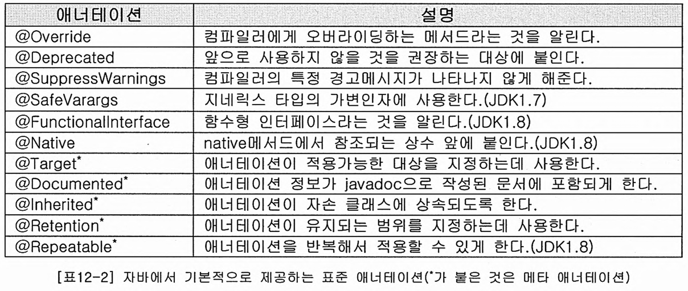
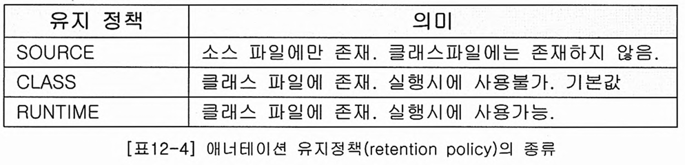

# 제네릭스, 열거형 어노테이션

> ## Index
> #### 1. 제네릭스
> #### 2. 열거형
> #### 3. 어노테이션


<br />
<br />

## 1. 제네릭스
* 제네릭스란?
    - 다양한 타입의 객체들을 다루는 메서드나 컬렉션 클래스의 컴파일시 타입체크를 해주는 기능이다.
    - 객체타입을 컴파일시에 체크하기 때문에 객체타입의 안정성을 높이고 형변환의 번거로움이 줄어든다.
    - 다룰 객체의 타입을 미리 명시함으로서 번거로운 형변환 작업을 줄여준다.
* 객체 타입의 안정성이란
    - 의도하지 않은 타입의 객체가 저장되는 것을 막고 저장된 객체를 꺼내올 때 원래의 타입과 다른 타입으로  
        잘못 형변환되어 발생할 수 있는 오류를 줄여주는것이다.
* 제네릭스의 장점
    - 타입 안정성을 제공한다.
    - 타입체크와 형변환을 생략할 수 있으므로 코드가 간결해진다.


<br />

## 2. 열거형
<br />

## 3. Annotation 어노테이션
* 어노테이션이란?
    - 소스코드에 대한 문서를 하나로 관리하기 위해 소스코드의 주석으로부터 HTML문서를 생성해내는 프로그램(javadoc.exe)을 만들어  
        사용했는데, 이 기능을 이용하여 프로그램 소스코드 안에 다른 프로그램을 위한 정보를 미리 약속된 형식으로 포함시킨 것이다.
    - 주석처럼 프로그램밍 언어에 영향을 미치지 않으면서 다른 프로그램에게 유용한 정보를 제공할 수 있다는 장점이 있다.
    - 어노테이션은 @을 붙여서 컴파일러에게 어노테이션이라고 알릴 수 있고, 값을 세팅할 수 있는 요소를 가질 수 있다.
* 어노테이션의 선언위치
    - 어노테이션은 클래스, 인터페이스, 메서드, 메서드 파라미터, 필드위에 위치할 수 있다.
* 표준 어노테이션
    - 자바에서 기본적으로 제공하는 어노테이션은 몇개 없으며, 이 중 일부는 메타 어노테이션으로 어노테이션을 정의하는데 사용되는  
        어노테이션의 어노테이션이다.

* 제공 어노테이션의 종류와 속성
    - @Override
        + 슈퍼클래스의 메서드를 오버라이드했다는것을 알려준다. 이 어노테이션을 붙일경우 컴파일러가 같은 이름의 메서드가 슈퍼클래스에  
            있는지 확인 후 없으면 에러메세지를 출력한다.
        + 필수는 아니지만, 해당 어노테이션을 붙이지 않았을경우 오버라이드된 메서드명이 다르거나 슈퍼클래스의 메서드명이 변경되었을 경우  
            알 수 없기 때문에 사용하는것이 좋다.
    - @Deprecated
        + 해당 클래스/메서드는 더이상 지원하지 않거나 더 좋은 해결법이 생겼으므로 사용하지 말라는 의미로 만약 해당 어노테이션이 붙은  
            클래스/메서드를 사용할 경우 경고메세지가 나타난다.
    - @FunctionalInterface
        + 함수형 인터페이스를 선언할 때 해당 어노테이션을 사용할 경우 컴파일러가 함수형 인터페이스를 올바르게 선언했는지 확인하고  
            잘못되었을 경우 에러메세지를 출력한다.
    - @SuppressWarnings
        + 컴파일러가 보여주는 경고메세지가 나타나지 않도록 억제해준다. SuppressWarnings로 억제할 수 있는 경고의 종류는 여러개가  
            있는데, 억제하고자 하는 경고메세지를 어노테이션의 뒤에 ()를 붙여 문자열로 지정해주면 된다.  
            만약 둘 이상의 경고메세지를 괄호안에 중괄호를 추가한 후 컴마로 구분하여 사용한다. ({a, b})
* 메타 어노테이션
    - 어노테이션을 정의할 때 어노테이션의 적용대상이나 유지기간등을 지정하는데 사용한다.
    - @Target
        + 어노테이션이 사용될 자바요소를 지정한다.
        + FIELD는 기본형 타입에, TYPE_USE는 참조형 타입에 사용된다.
        
    - @Retention
        + 얼마나 오랫동안 어노테이션 정보가 유지되는지 지정할 수 있다.
        + 유지정책을 RUNTIME으로 하면 리플렉션을 통해 클래스파일에 저장된 어노테이션의 정보를 읽어서 처리할 수 있다.
        + CLASS의 경우 컴파일러가 어노테이션의 정보를 클래스 파일에 저장할 수 있게는 하지만, 클래스 파일이 JVM에 로딩될 때에는  
            어노테이션의 정보가 무시되어 실행시 어노테이션의 정보를 얻을 수 없어 잘 사용되지 않는다.
        
    - @Documented
        + 어노테이션에 대한 정보가 javadoc으로 작성한 문서에 포함되도록 한다.
    - @Inherited
        + 이 어노테이션을 사용한 슈퍼클래스를 상속한 자손클래스에서도 해당 어노테이션을 상속받도록 한다.
    - @Repeatable
        + 보통 하나의 대상에 하나의 어노테이션을 붙이는데, 같은 어노테이션을 여러번 붙일 수 있게 해준다.
        + 같은 이름의 어노테이션 여러개가 하나의 대상에 적용될 수 있기 때문에 이 어노테이션을 하나로 묶어서 다룰 수 있는 어노테이션도  
            추가로 정의해야 한다.
* 어노테이션 타입의 정의
    - 새로운 어노테이션을 정의할 때에는 인터페이스의 앞에 어노테이션을 의미하는 @를 붙여주면 된다.
    - 어노테이션 내에 선언된 메서드를 어노테이션의 요소라고 하며, 어노테이션의 요소는 반환값이 있고 매개변수는 없는 추상메서드의  
        형태를 가지며 상속을 통해 구현하지 않아도 된다.  
        단, 어노테이션을 적용할 때 각 요소들의 값을 빠짐없이 적어주어야 한다.
    - 어노테이션의 각 요소는 기본값을 정해줄 수 있고, 어노테이션을 적용할 때 값을 지정하지 않을경우 기본값이 사용된다.
    - 어노테이션의 요소가 하나뿐이고 그 이름이 value일 경우 요소의 이름을 생략하고 간단히 적을 수 있다.
``` java
// 어노테이션및 어노테이션의 요소 정의
@Target(ElementType.METHOD)
@Retention(RetentionPolicy.RUNTIME)
public @interface TestInf {
    int count() default 0;  // 요소의 기본값 지정
    String name();
    String[] product();
}
// 정의된 어노테이션의 사용

public class Test {

    @TestInf(count = 1, name = "sunny", product = {"pen", "phone"})
    private void name() {

    }
}
```
* 마커 어노테이션
    - 값을 지정할 필요가 없을경우 어노테이션의 요소를 지정하지 않을수도 있는데, 요소가 하나도 정의되지 않은 어노테이션을  
        마커 어노테이션이라고 한다.
* 어노테이션 요소의 규칙
    - 요소의 타입은 기본형, String, enum, 어노테이션, Class만 허용된다.
    - ()안에 매개변수를 선언할 수 없다.
    - 예외를 선언할 수 없다.
    - 요소를 타입 매개변수로 정의 할 수 없다.
``` java
public @interface TestInf {
    int age = 20;
    String name(String names);  // 매개변수는 선언할 수 없다.
    String name throwsException;    // 예외를 선언할 수 없다.
    ArrayList<T> list();    // 타입매개변수를 정의할 수 없다.
}
```


